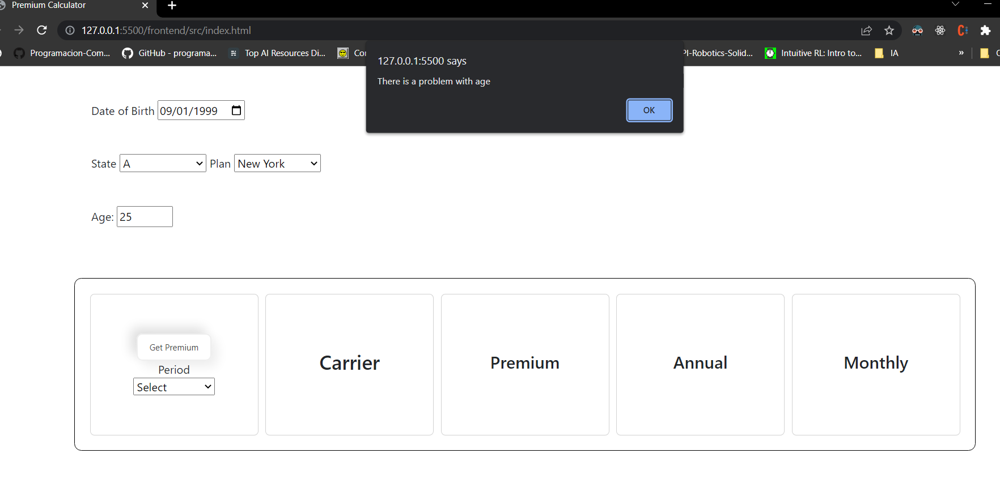

# Tranzact Challenge
## Requirements
1. Install COR Extension for Google Change and active this function.
2. Install necessary dependencies to run backend server, to do it, go to this directory ./backend and run this command **npm install**
3. To run backend server run the following command **npm run dev**

# Test challenge
1. If the age is incorrect

# Project
<video width="400" height="400" controls> <source src="tranzact.mp4" type="video/mp4"> </video>
